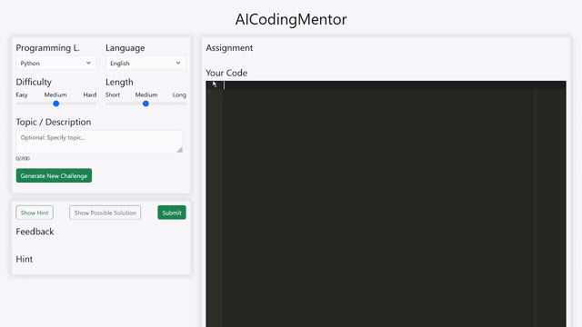

<a href="https://www.buymeacoffee.com/christoph_straeter" target="_blank"></a>
# AICodingMentor 
Generate fun coding challenges and improve your skills.

This app uses LLMs to generate coding challenges for common programming languages. The user can also choose the language, the level of difficulty and challenge length, and specify the topic. They can show a hint, a possible solution and get feedback on their attempts.



## Installation
1. Install the required packages
```bash
pip install -r requirements.txt
```
(optionally you can first create a virtual environment)

2. Create a .env file in the root folder with the following content (or copy/paste the content of the .env.example file)
```bash
OPENAI_API_KEY=<your_openai_api_key>
```

3. Optionally you can choose another (OpenAI) LLM model, the default model is `gpt-4o-mini`
```bash
LLM_MODEL=<name_of_llm>
```

## Usage

1. Run the following command to start the flask app
```bash
python main.py
```
2. Go to http://127.0.0.1:5000/ in your browser
3. Have fun

## License
This project is licensed under the MIT License - see the [LICENSE](LICENSE) file for details.

